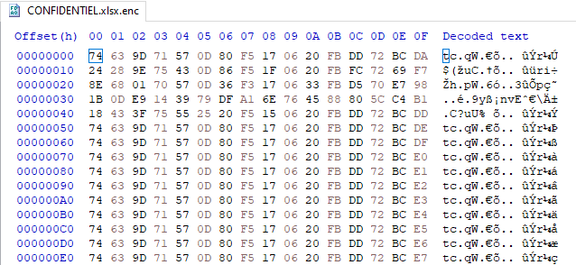
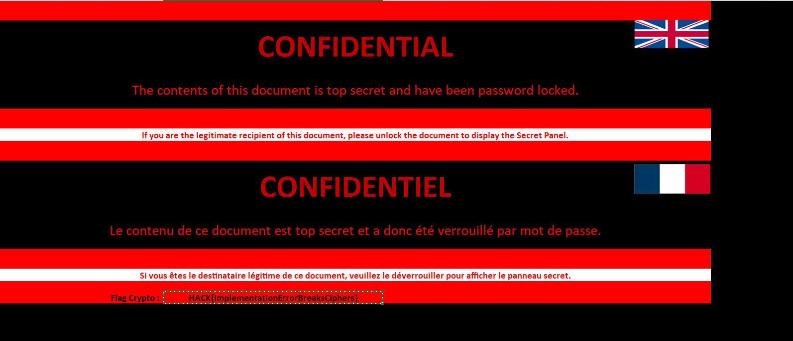

# Crypto
Points: 100

# Énoncé

Vous avez réussi à obtenir l'accès au dossier où se situent les fichiers uploadés.
Cependant, tous les fichiers sont chiffrés.
Fort heureusement, l'algorithme de chiffrement est présent dans le dossier, trouver un moyen de le déchiffrer.

Essayez de vous attaquer à une partie de l'algorithme pour réduire le temps de calcul.

# Résolution
Un premier visionnage du fichier dans un éditeur hexadécimal nous confirme 2 choses:
- Le fichier est bien chiffré (l'entête zip du xlsx n'est pas trouvable)
- Le chiffrement semble assez étrange car on voit une valeur augmenter au fur à mesure du fichier (là où le xlsx contient probablement des 0x00)



Cela conduit à penser que déjà ce chiffrement est dépendant des données d'entrée et n'évolue pas beaucoup d'un block à l'autre.
Maintenant vérifions cela dans le code:

```python
def encrypt(self, plaintext):
    while len(plaintext)%16:
        plaintext += b'\0'

    ctr = random.getrandbits(128)

    encrypted = ctr.to_bytes(16, 'big')
    for i in range(0, len(plaintext), 16):
        encryptedBlock = self.encryptBlock(ctr.to_bytes(16, 'big'))
        encrypted += bytes(self.xor(plaintext[i:i+16], ctr.to_bytes(16, 'big')))
        ctr += 1
    return encrypted  
```

encrypt est la principale fonction du chiffrement, encryptBlock semble en être une autre mais dans ce code encryptedBlock qui en découle n'est jamais utilisé.
De ce fait le mot de passe du chiffrement n'est jamais impliqué dans le processus de chiffrement.

Finalement le chiffrement pour chaque bloc revient à un ```xor(block, ctr)```.
Codons rapidement de quoi déchiffrer le fichier:
```python
def xor(a, b):
    res = []
    for ac, bc in zip(a, b):
        res.append(ac^bc)
    return res

def decrypt(cipher, ctr):
    result = b""
    for i in range(0, len(cipher), 16):
        result += bytes(xor(cipher[i:i+16], ctr.to_bytes(16, 'big')))
        ctr += 1
    return result


f = open("CONFIDENTIEL.xlsx.enc", 'rb')
out = open("out.xlsx", "wb")
cipher = f.read()
ctr = int.from_bytes(cipher[:16], 'big')
data = decrypt(cipher[16:], ctr)
out.write(data)
out.close()
f.close()
```

On peut ensuite ouvrir `out.xlsx` et on y trouve le flag:


Flag:
> HACK{ImplementationErrorBreaksCiphers}			
