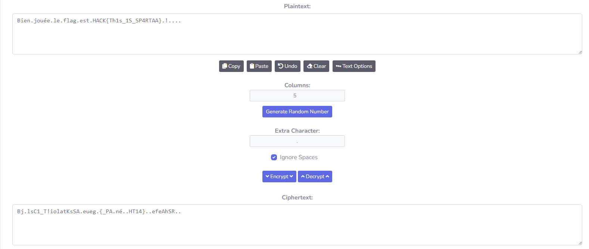

# Scytale
Points: 100

# Énoncé
(Challenge hors scénario)

En fouillant une planque utilisée par des cyber-attaquants, la Police a retrouvé de curieuses bandelettes de papier sur lesquelles sont inscrites des lettres.A quoi peuvent-elles bien servir ?

Les chiffrements de transposition sont les plus anciens dispositifs de cryptographie militaire connue.

# Résolution
Message trouvé:
> Bj.lsC1_T!iolatKsSA.eueg.{_PA.né..HT14}..efeAhSR..

On peut se rendre sur [CacheSleuth](https://www.cachesleuth.com/scytale.html) (par exemple) pour décoder le message.
On peut essayer différentes valeurs pour la taille des colonnes mais le choix est limité par la longueur totale du message (50) qui doit en être un multiple, en testant dans l'ordre 2, 5, ... 

Flag:
> HACK{Th1s_1S_SP4RTAA}