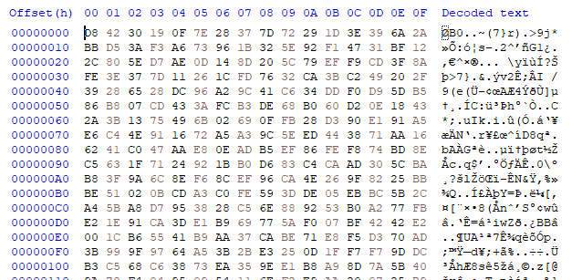
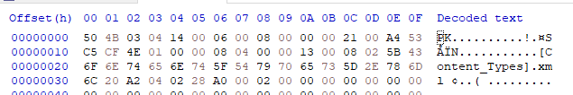
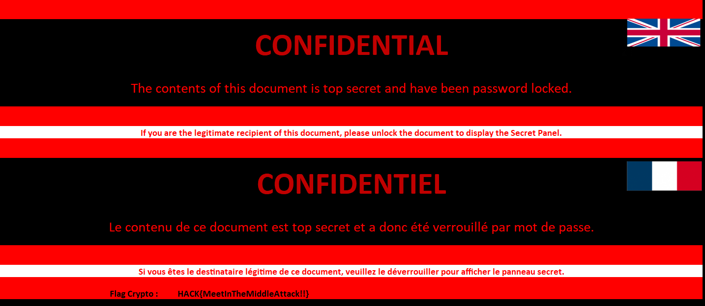

# What_If_?_Crypto
Points: 400

# Énoncé
## Qu'est-ce qui se passerait si c'était plus complexe ? 
Il est nécessaire de continuellement monter en compétence afin de pouvoir faire face aux menaces futures.
Nos équipes ont donc recréé le scénario d'attaques en relevant le niveau technique.

L'objectif reste le même : déchiffrer le fichier CONFIDENTIEL.xlsx.

# Résolution

Comparé au challenge [Crypto](../Crypto/ReadMe.md), on voit tout de suite la différence à l'observation du fichier en hexa:


On ne retrouve plus du tout d'indication des bytes nulles du fichiers original ni de cycle dans les bytes chiffrés.

## Analyse du code
Commençons par le code qui était la vulnérabilité du challenge précédent:  cette fois ci `encryptBlock` est bien utilisé pour fournir la valeur qui est ensuite xor avec notre plaintext. 
```python
encryptedBlock = self.encryptBlock(ctr.to_bytes(16, 'big'))
encrypted += bytes(self.xor(plaintext[i:i+16], encryptedBlock))
```

En regardant `encryptBlock`, rien ne saute aux yeux, on va devoir deviner self.key pour pouvoir décoder/reproduire un block.
En regardant plus attentivement `generateKey`, on découvre que la clé est dérivée par un sha256 à chaque block. On remarque également que seuls 6 caractères du hash sont conservés pour le chiffrement et la dérivation de la clé suivante.
```python
def generateKey(self):
    self.key = hashlib.sha256(self.key).digest()[:6]
    return self.key
```
On doit donc deviner 6 bytes !

## MITM (Meet In The Middle)
Une attaque possible pour réduire la compléxité du bruteforce et de séparer l'opération en 2: chiffrer avec 3 bytes et décoder avec 3 bytes.
Le principe est de créer 2 listes de résulats et si une valeur est en commun entre les 2 on peut en déduire que l'on a trouvé les 3 bons premiers bytes et les 3 bons derniers bytes.

### Comment décoder ?
Le format du xlsx est connu et après quelques tests on arrive à isoler un block qui ne varie pas donc qui peut nous servir de plaintext:


La valeur suivante `ontent_Types].xm` nous servira de plaintext (mais du coup cela nous force à ne déconner qu'à partir du 3e block), on espère donc pouvoir réparer le header précédant à la main.

Ensuite il suffit d'inverser la fonction `encryptBlock`. Pour cela je la décompose dans un premier temps en une fonction qui applique les 3 bytes de la clé qui elle même appelle une fonction qui ne fait uniquement appliquer le round. 
Je créée l'inverse de toutes ces fonctions et obtient une fonction qui à partir des 3 derniers bytes de la clé retrouve la sortie du chiffrement des 3 premiers.

### Implémentation du bruteforce
Il s'agit simplement de bruteforce les 3 bytes et d'écrire le resultat des opérations de chiffrements et déchiffrements dans 2 fichiers différents (plusieurs centaines de Mo à la fin).
Ensuite on compare les valeurs de ces fichiers pour en trouver une commune: `awk 'NR==FNR{a[$4];next} ($4 in a)' hashes_part1.txt hashes_part2.txt `

On trouve un hash intermédiaire commun `e8167bc0991aa64cdd33133917b26c5a` qui nous permet ensuite de retrouver les bytes utilisés. 
On récupère ainsi la clé pour déchiffrer le fichier à partir du block n°3. 
Il suffit ensuite d'ajouter le header copié du premier fichier et on peut ouvrir le fichier !



Flag:
> HACK{MeetInTheMiddleAttack!!}		
