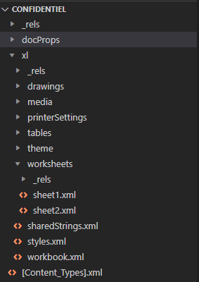
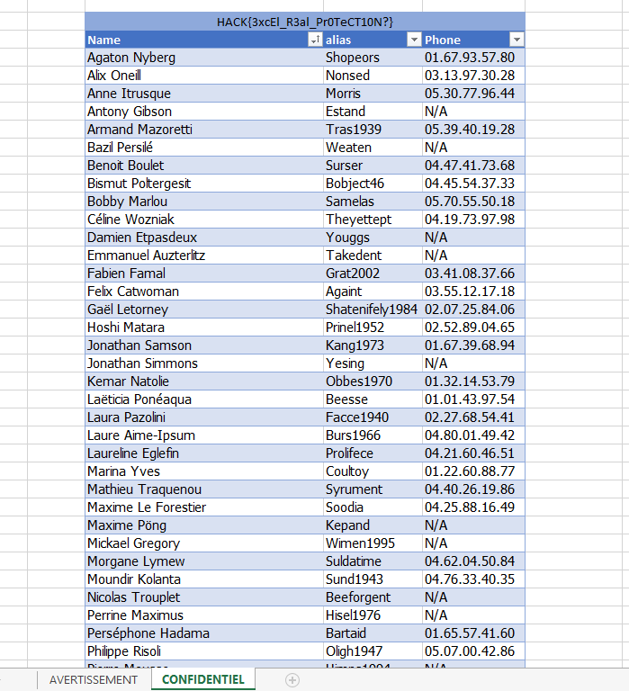

# Excel Confidential
Points: 200

# Énoncé
Dans le dossier contenant les fichiers uploadés, nous avons trouvé un fichier excel.
Lise MITENER nous confirme que ce document ne lui appartient pas.
Le document est protégé par un mot de passe. Trouver un moyen d'accéder à l'information que contient ce tableur.

Les documents excel ont tous une architecture semblable, il existe surement une méthode simple pour outrepasser la protection.

# Résolution
Un fichier Excel est une archive Zip, on peut donc le décompresser pour avoir un peu plus de détails sur son contenu.



On remarque qu'il y a 2 sheets alors que le document ne nous en montrait qu'une seule.

## Méthode A: modifier et reconstruire le document
Dans `workbook.xml` on trouve le code qui définit la visibilité des différentes pages:
```xml
<sheets>
    <sheet name="AVERTISSEMENT" sheetId="1" r:id="rId1" />
    <sheet name="CONFIDENTIEL" sheetId="4" state="hidden" r:id="rId2" />
</sheets>
```
On peut éditer le `state="hidden"` pour rendre visible la seconde page. Il suffit de rezipper le fichier et le renommer en xlsx pour pouvoir l'ouvrir.


## Méthode B: Qui a besoin d'Excel ?
On a accès au contenu brut du fichier donc le flag est forcément dedans !
Le fichier `sharedStrings.xml` contient les chaines de caractères des différentes feuilles, il suffit de chercher "HACK" dedans pour mettre la main sur le flag!

```xml
<si>
    <t>HACK{ImplementationErrorBreaksCiphers}</t>
</si>
```

Flag:
> HACK{3xcEl_R3al_Pr0TeCT10N?}