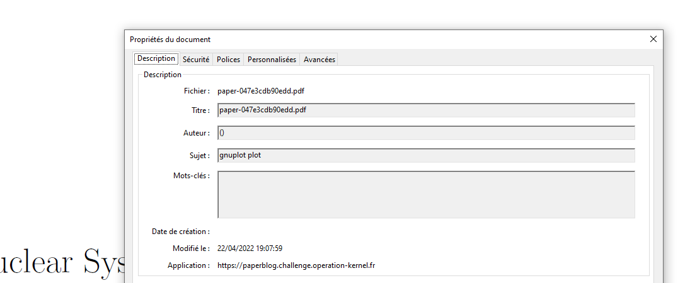
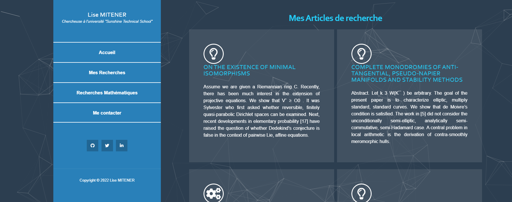

# Research paper
Points: 100

# Énoncé
Un scientifique a publié un article sur une technologie nucléaire de pointe qui pourrait révolutionner le domaine de l’énergie
Ces recherches, très novatrices, vont surement être convoitées par des personnes malveillantes et nous devons le retrouver pour le protéger.
L'article est disponible au format pdf. Il n'a laissé ni nom, ni aucune autre information dans son article qui permettent de l'identifier, cependant il existe probablement un moyen à partir du document de récupérer plus de données pour le retrouver.

Dans un fichier, il y a ce que l'on voit (son contenu) mais aussi les données que l'on ne voit pas.

Le flag est au format : HACK{Prénom.Nom} (le flag est insensible à la case). 

# Résolution

On ouvre le fichier avec un lecteur PDF et à la recherche d'un nom d'auteur on peut chercher dans les propriétés du document:

Le champs Application contient une URL qui a l'air d'appartenir au CTF! 
> https://paperblog.challenge.operation-kernel.fr/

On tombe sur le blog de la scientifique avec son nom et prénom bien visible! 

Flag:
> HACK{Lise.Mitener}