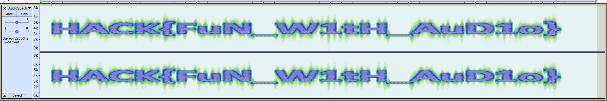

# AudioSpectre
Points: 100

# Énoncé
(Challenge hors scénario)

Un lecteur MP3 a été retrouvé à côté d’un serveur compromis lors d’une cyberattaque. Dessus, seul un fichier audio a été retrouvé. Prêt pour un interlude musical ?

Même si un son a pour but premier d'être écouté, l'analyse de son spectre peut présenter tout autant d'intérêt et révéler des messages cachés.

# Résolution

Vu l'énoncé on cherche le specter de l'audio fourni, sur audacity on peut obtenir cela facilement avec l'option de vue Spectogram depuis la piste son.

Flag:
> HACK{FuN_W1tH_Aud1o}