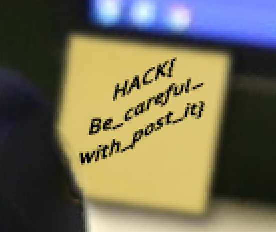

# Takazume
Points: 100

# Énoncé
(Challenge hors scénario)

Nous avons retrouvé une photo des bureaux d'une entreprise. A vous de trouver s’il y a de l’information exploitable, qui pourrait créer un incident de sécurité.
Visiblement, l'entreprise Takazume n'a pas suffisamment sensibilisé ses employés aux bonnes pratiques de sécurité informatique.

# Résolution

Le titre et la résolution de l'image laisse penser qu'il suffit de zoomer sur l'image pour trouver le flag.
Et en effet en zoomant sur un post-it on a le flag.

Flag:
> HACK{Be_careful_with_post_it}